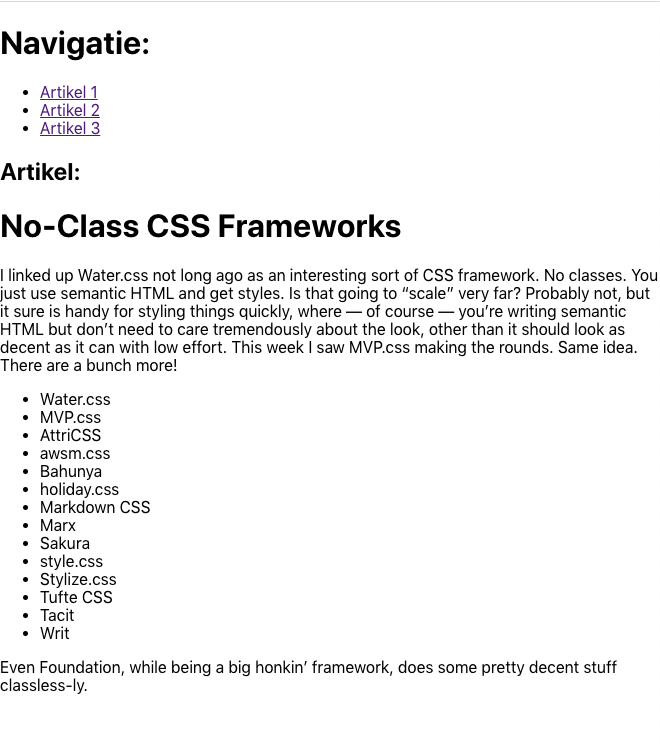

This project was bootstrapped with [Create React App](https://github.com/facebook/create-react-app).

## Available Scripts

In the project directory, you can run:

### `npm install` and `npm start`

Runs the app in the development mode. 
Open [http://localhost:3000](http://localhost:3000) to view it in the browser.

The page will reload if you make edits. 
You will also see any lint errors in the console.

## Opdrachtbeschrijving

Maak een website met routing door gebruik te maken van <code>react-router-dom</code>. Er zitten al drie pagina's (artikelen) in de <code>pages</code> map die je kunt gebruiken. Zet de routing in <code>App.js.</code>

### What the page should look like

